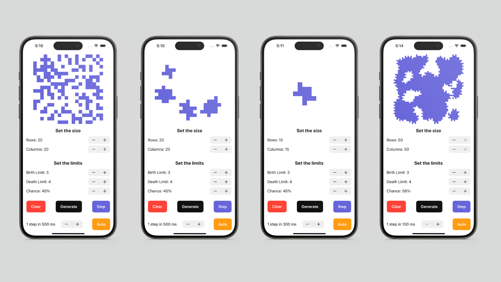

# Cave

Генерация с использованием клеточного автомата.

Generation using a cellular automaton.

## Русскоязычная версия

Генерация пещер

Во многих играх есть необходимость в ветвящихся локациях, например пещерах.
Такие локации могут быть созданы генерацией с использованием клеточного автомата.

Суть алгоритма состоит в реализации всего двух шагов:
сначала все поле заполняется случайным образом стенами — т.е. для каждой клетки случайным образом определяется,
будет ли она свободной или непроходимой — а затем несколько раз происходит обновление состояния карты в соответствии с условиями.

Правила: есть две специальные переменные, одна для "рождения" "мертвых" клеток (предел "рождения") и одна для уничтожения "живых" клеток (предел "смерти").
Если "живые" клетки окружены "живыми" клетками, количество которых меньше, чем предел "смерти", они "умирают".
Аналогично если "мертвые" клетки находятся рядом с "живыми", количество которых больше, чем предел "рождения", они становятся "живыми".

### Основные возможности

- Пользователем задается размер пещеры: количество строк и столбцов, максимальный размер - 50 х 50
- Пользователем задаются пределы "рождения" и "смерти" клетки, а также шанс на начальную инициализацию клетки
- Пределы "рождения" и "смерти" могут иметь значения от 0 до 7
- Предусмотрен пошаговый режим отрисовки результатов работы алгоритма в двух вариантах:
  - По нажатию на кнопку следующего шага отрисовывается очередная итерация работы алгоритма
  - По нажатию на кнопку автоматической работы запускается отрисовка итераций работы алгоритма с частотой 1 шаг в `N` миллисекунд, где число миллисекунд `N` задаётся через специальное поле в пользовательском интерфейсе

### Вид приложения

## The English version

Cave Generation

In many games there is a need for branching locations, such as caves.
They can be created by generation using the cellular automaton.

The idea of the algorithm consists of implementing only two steps: first, the whole field is filled randomly with walls - i.e., for each cell it is randomly determined whether it will be free or impassable - and then the map state is updated several times according to the conditions.

The rules: there are two special variables, one for "birth" of "dead" cells (the "birth" limit) and one for destruction of "live" cells (the "death" limit).
If "live" cells are surrounded by "live" cells, the number of which is less than the "death" limit, they "die". In the same way, if "dead" cells are next to "live" cells, the number of which is greater than the "birth" limit, they become "live".

### Main features

- The user sets the size of the cave: the number of rows and columns, the maximum size is 50 x 50
- The user sets the limits for "birth" and "death" of a cell, as well as the chance for the starting initialization of the cell
- The "birth" and "death" limits can have values from 0 to 7
- A step-by-step mode of rendering the algorithm results in two variants is provided:
    - Pressing the next step button will lead to rendering the next iteration of the algorithm
    - Pressing the automatic work button starts rendering iterations of the algorithm with a frequency of 1 step in `N` milliseconds, where the number of milliseconds `N` is set through a special field in the user interface

### View Application

